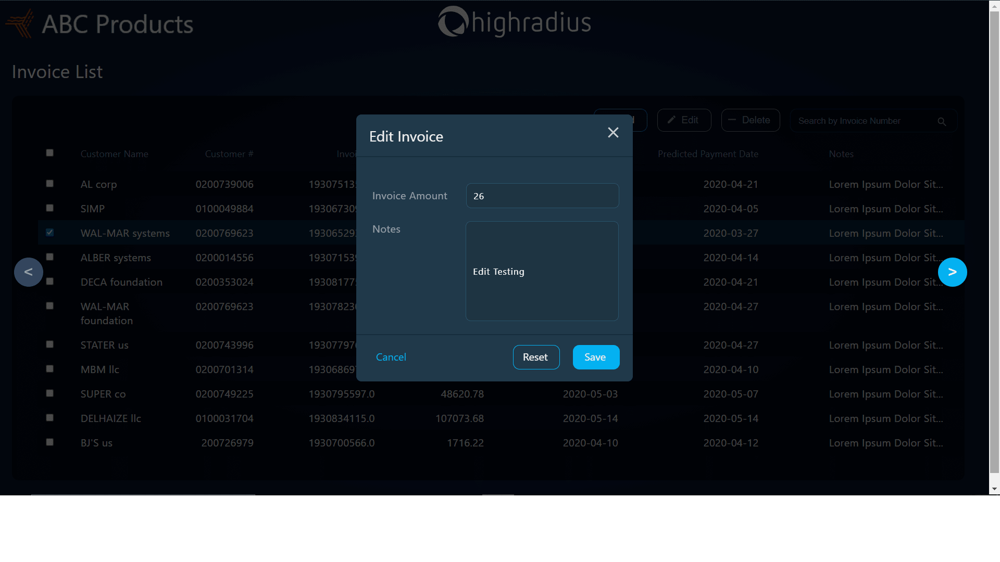

#  AI-Enabled FinTech B2B Invoice Management Application

---

##  Introduction to B2B Operations

The dynamics of the B2B world differ from the B2C or C2C setups. In B2B transactions, businesses engage in credit-based interactions. When a buyer business places an order with a seller business, the seller issues an invoice containing essential information about the purchased goods and the payment timeline. In accounting terms, this is referred to as "Accounts Receivable."

---
##  Problem Statement

- In an ideal scenario, buyers should adhere to the Payment Term and make timely payments. However, in reality, businesses often fail to pay within the specified time frame, necessitating the involvement of the Account Receivables Department.
- Every company maintains a dedicated Account Receivables Department responsible for monitoring and collecting invoice payments.
- The Account Receivables team's key responsibilities include retrieving payments for overdue invoices, sending payment reminders to customers, overseeing the entire cash inflow process, and facilitating timely compensation for provided services and products.
- Developed a Machine Learning Model to forecast invoice payment dates upon their creation in the system.
- Created a comprehensive, end-to-end Invoice Management Application with a full-stack implementation.

---

##  Features

- Utilized Machine Learning to create a predictive model for invoice payment dates upon creation in the system.
- Developed a user-friendly Receivables Dashboard for visualizing data in grid format.
- Implemented ADD, EDIT, and DELETE functionalities to manage data effectively.
- Streamlined navigation through the implementation of pagination for a seamless user experience.

---

##  Technologies Used

### Machine Learning

- **Pandas**
- **Numpy**
- **Matplotlib**
- **Scikit-learn**

### Frontend

- **HTML**
- **CSS**
- **JavaScript**
- **JQuery**

### Backend

- **Java**
- **Servlets**
- **JDBC**
- **JSP**
- **MySQL**

### Tools

- **Eclipse IDE**
- **TomCat Server**
- **Postman API Testing Tools**
- **SQL Yog**
- **Jupyter Notebook**

---
##  Screenshots

---
